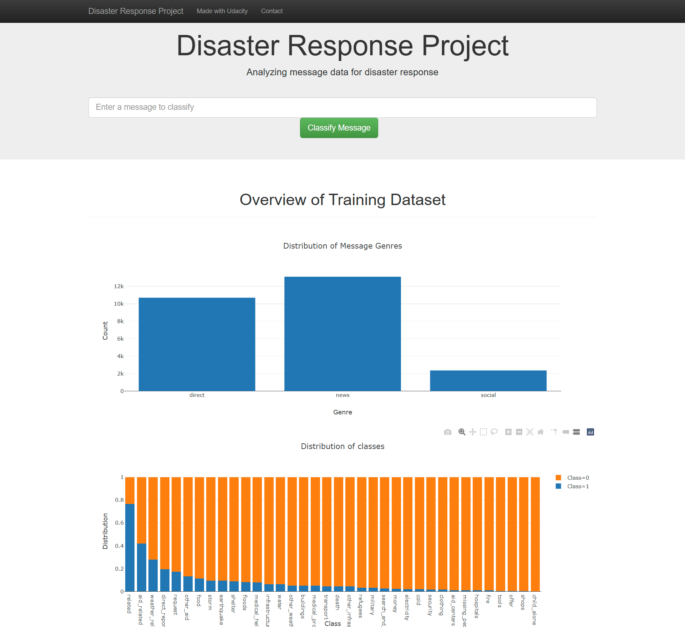
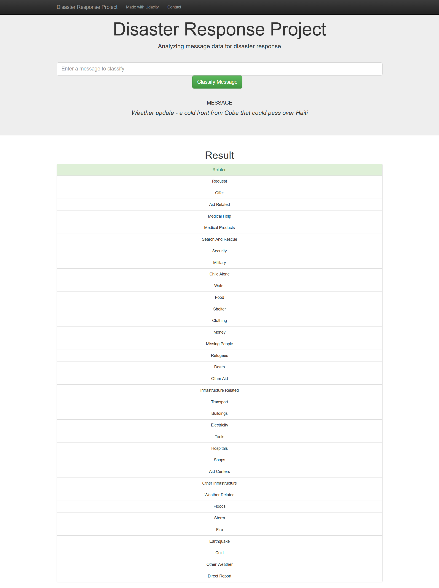

# Disaster Response Pipeline Project
### Overview

This project builds a Natural Language Processing (NLP) model to classify messages sent during disasters. The goal is to help emergency response organizations quickly identify and route messages to appropriate disaster relief agencies.

The project includes:
- ETL Pipeline to clean and process message data
- Machine Learning Pipeline to train multi-output classifier
- Web App to classify new messages in real time

The web application allows rescuers to enter new messages and receive classification results across 36 different categories. The application also displays a visualization of the training dataset.

Features:
- Uses scikit-learn machine learning pipeline
- Implements multi-label classification
- Built with Flask web framework
- Interactive visualizations using Plotly
- Responsive UI based on Bootstrap

### Demo Screenshots
#### Master Page

#### Classification Results

### Project Structure
~~~
├── app/  
│   ├── templates/  
│   │   ├── master.html         # Master page  
│   │   └── go.html             # Classification results page  
│   └── run.py                  # Flask application  
│  
├── data/  
│   ├── disaster_messages.csv   # Original dataset  
│   ├── disaster_categories.csv # Classification labels  
│   ├── DisasterResponse.db     # Database  
│   └── process_data.py         # ETL pipeline script  
│  
├── models/  
│   ├── classifier.pkl          # Trained model  
│   └── train_classifier.py     # ML pipeline script  
│  
└── README.md                   # README
~~~

### Installation
Use the python version: `3.8.10` and run the following command:
`pip install -r requirements.txt`

### NOTICE:
Because we can't push large file into github, that why in this example we used slice 5000 first rows of the dataset to train the model

### Instructions:
1. Run the following commands in the project's root directory to set up your database and model.

    - To run ETL pipeline that cleans data and stores in database  
        `python data/process_data.py data/disaster_messages.csv data/disaster_categories.csv data/DisasterResponse.db`
    - To run ML pipeline that trains classifier and saves  
        `python models/train_classifier.py data/DisasterResponse.db models/classifier.pkl`

2. Run the following command in the app's directory to run your web app.  
    `cd app`  
    `python run.py`

3. Go to http://0.0.0.0:3001/
